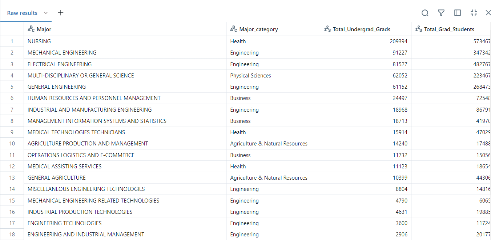

[](https://github.com/nogibjj/Mobasserul_Haque_MiniProject12/actions/workflows/cicd.yml)

# Dockerized Application

## Project Overview

This project demonstrates a simple Python Flask application containerized using Docker. The application calculates the user's age based on their Date of Birth (DOB). The project incorporates CI/CD to automate building and pushing the Docker image to Docker Hub.

---
## Features

- **Flask Web Application**: A web application that calculates age from the provided Date of Birth.
- **Dockerized Deployment**: The application is containerized for seamless deployment across environments.
- **Makefile Automation**: Simplifies Docker commands for building, running, and pushing the container.
- **CI/CD Integration**: Automates the Docker build and push process using GitHub Actions.

---

## Directory Structure

```
├── .github/
│   └── workflows/
│       └── cicd.yml
├── .coverage
├── .gitignore
├── app.py
├── Dockerfile
├── Makefile
├── README.md
├── requirements.txt

```
## Setup Instructions

1. **Clone the Repository**

```bash
git clone https://github.com/nogibjj/Mobasserul_Haque_MiniProject12.git
cd Mobasserul_Haque_MiniProject12
```

2. **Build the Docker Image**

Build the Docker image using the Makefile:

```bash
make build
```

3. **Run the Docker Container**

```bash
make run
```
Access the application in your browser at [http://localhost:5000](http://localhost:5000).

4. **Push the Docker Image to Docker Hub**

Authenticate with Docker Hub and push the image:

```bash
make push
```
## Flask Application Details

### Endpoints

- **Home Page (`/`)**: Displays a form for users to enter their Date of Birth.


- **Calculate Age (`/calculate_age`)**: Processes the DOB input and calculates the user's age.

---
## CI/CD Integration

This project uses GitHub Actions to automate Docker image builds and deployments. The workflow (`.github/workflows/cicd.yml`) performs the following steps:

1. **Checks out the repository**
2. **Logs into Docker Hub** using repository secrets
3. **Builds the Docker image**
4. **Pushes the image to Docker Hub**

## Deployment to Docker Hub

### Manually

1. **Log in to Docker Hub:**

```bash
	docker login -u ${DOCKER_ID_USER}
```


2. **Tag the Docker Image:**

```bash
docker tag dockerized_app <your-dockerhub-username>/dockerized_app:latest
```

3. **Push the Image:**

```bash
docker push mobasserulhaque/mh_de_week12:tagname
```
4. **Pull the Image:**

```bash
docker pull mobasserulhaque/mh_de_week12:latest
```


### Using Make Commands

Alternatively, use the following command to simplify the process:

```bash
make push
```

---

## Docker Hub Details

- **Docker Image:** [dockerized_app_image_Link](https://hub.docker.com/repository/docker/mobasserulhaque/mh_de_week12)
- **Tag:** `latest`

---


## Usage
To run the ETL process or execute queries, use the following commands:

### Extract Data
To extract data from the CSV files, run:

```python
python main.py extract
```
### Load Data
To transform and load data into the Databricks database, execute:
```python
python main.py load
```

### Load Data
To transform and load data into the Databricks database, execute:
```python
python main.py load
```
## Execute SQL Query
To run a SQL query against the Databricks database, use:

```python
python main.py query "<your_sql_query>"
```

## Complex SQL query 1:

```sql
SELECT 
    rg.Major, 
    rg.Major_category, 
    rg.Total AS Total_Undergrad_Grads, 
    gs.Grad_total AS Total_Grad_Students, 
    AVG(rg.Unemployment_rate) AS Avg_Undergrad_Unemployment_Rate, 
    AVG(gs.Grad_unemployment_rate) AS Avg_Grad_Unemployment_Rate, 
    AVG(rg.Median) AS Avg_Undergrad_Median_Salary, 
    AVG(gs.Grad_median) AS Avg_Grad_Median_Salary 
FROM 
    RecentGradsDB rg 
JOIN 
    GradStudentsDB gs 
ON 
    rg.Major_code = gs.Major_code 
GROUP BY 
    rg.Major_category, 
    rg.Major, 
    rg.Total, 
    gs.Grad_total 
HAVING 
    AVG(rg.Unemployment_rate) < 0.06 
ORDER BY 
    rg.Total DESC;

```
This SQL query joins two tables, RecentGradsDB and GradStudentsDB, and retrieves aggregate information about undergraduate and graduate employment, salary statistics, and unemployment rates for different majors

The query provides a list of majors along with details such as the total number of undergraduate and graduate students, the average unemployment rates, and the average median salaries for both undergraduate and graduate levels. The results are filtered to include only majors where the average undergraduate unemployment rate is below 6%, and the majors are sorted by the total number of undergraduates in descending order

### Expected output:

This output highlights majors with low unemployment rates and the comparison between undergraduate and graduate outcomes



## Complex SQL query 2:

```sql

SELECT Major, 'Undergrad' AS Degree_Level, Total AS Total_Students 
FROM RecentGradsDB 
WHERE Total > 5000 
UNION 
SELECT Major, 'Graduate' AS Degree_Level, Grad_total AS Total_Students 
FROM GradStudentsDB 
WHERE Grad_total > 5000 
ORDER BY Total_Students DESC;

```

This SQL query combines data from two different tables (`RecentGradsDB` and `GradStudentsDB`) to show majors that have more than 5,000 students at both undergraduate and graduate levels, and it orders the results by the total number of students in descending order.

`SELECT` statement Part1 (**Undergraduate data**):

-Retrieves the Major, assigns the string `'Undergrad'` to the Degree_Level, and selects the total number of undergraduate students (Total) from the `RecentGradsDB` table.

-**Filters** (`WHERE Total > 5000`) to include only majors with more than 5,000 undergraduate students.

`SELECT` statement Part2 (Graduate data):

-Retrieves the Major, assigns the string `'Graduate'` to the Degree_Level, and selects the total number of graduate students (Grad_total) from the `GradStudentsDB` table.

-**Filters** (`WHERE Grad_total > 5000`) to include only majors with more than 5,000 graduate students.

`UNION` operator:

Combines the results from the two SELECT statements, ensuring that any duplicates are removed. 

`ORDER BY` Total_Students DESC:

Orders the combined result set by the total number of students (Total_Students) in descending order, showing majors with the highest total first.

### Expected output:

The output consists of a combined and sorted list of majors that have more than 5,000 students, with each entry labeled according to the degree level. The majors are ordered by the total number of students, showing those with the highest student counts first.


## Testing
run below command to test the script
```python
pytest test_main.py
```

## References 
1. https://github.com/nogibjj/sqlite-lab
2. https://learn.microsoft.com/en-us/azure/databricks/dev-tools/python-sql-connector